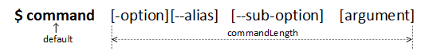

# command-handling
[](https://nodejs.org)   [](https://www.npmjs.com/package/command-handling/)

## Table of contents
1. [Introduction](#1-introduction)
2. [How to use](#2-how-to-use)
    * [Command line structure](#command-line-structure)
    * [Methods](#methods)
    * [Data structures](#data-structures)
    * [Usage](#usage)
3. [Examples](#3-examples)
4. [Thank you!](#4-thank-you)

## 1. Introduction


This is a lightweight tool that is using for Node.js CLI app. This package is also using for project [code-template-generator](https://www.npmjs.com/package/code-template-generator).

You should be using `command-handling` for small app that is not has many complex features. You can view [Commander.js](https://github.com/tj/commander.js) if you are thinking about a great Node.js CLI app.

`command-handling` help you to analyse the input command line. It catches the arguments that you may be waiting for then you decide what you want to do with the raw data after parsing.

## 2. How to use
### Command line structure
The simple command line structure that is used in this package:

`$ command [-option][--alias] [--sub-option] [argument]`

* An option has only an alias.
* An option has many sub options.
* Use cases:
    * `command` (only command without anything)
    * `command [argument]`
    * `command [-option][--alias]`
    * `command [-option][--alias] [argument]`
    * `command [-option][--alias] [--sub-option]`
    * `command [-option][--alias] [--sub-option] [argument]`
    * `command [--sub-option] [argument]`
* View examples for [code-template-generator](https://www.npmjs.com/package/code-template-generator#5-examples) to know more about use cases.

### Methods
|Method|Argument|Description|
|---|---|---|
|`.option()`|`<flag>, [alias], [description]`|Option definition|
|`.subOption()`|`<mainFlag>, <subFlag>, description`|Sub option definition|
|`.showOptions()`|-|It returns an option list in an object array|
|`.parse()`|`<process.argv>`|Parse the command line|

### Data structures



1. An object is returned when you call method `.parse(process.argv)`. You need this object for your coding. View [example](#example) for more detail.

```
{   // Result structure
    mainFlag: null,
    subFlags: [],
    argument: null,
    commandLength: 0,
    unknowns: []
}
```

2. An object array is returned when you call method `.showOptions()`. You may want to have the option list for your help function.

```
[   // All options
    {   // Option 1
        flag: '',     // main flag
        alias: '',
        description: '',
        subFlags: [
            {
                flag: '', // sub flag 1
                description: ''
            },
            {
                flag: '', // sub flag n
                description: ''
            }
        ]
    },
    {   // Option n
        ...
    }
]
```

## Using
* Step 1: Import `Command` object from `command-handling` package.
   * `const { Command } = require('command-handling');`
* Step 2: Declare an object for your app. You decide its name.
   * `const command = new Command();`
* Step 3: You can use method chaining for your `command` object.
    * Option definition: `.option(<flag>, [alias], [description])`
    * Sub option definition: `.subOption(<mainFlag>, <subFlag>, [description])`
* Step 4: Parse the command line and this step is in the end of chaining. You have few ways to parse the command line:
   * `.parse(process.argv);` -> End of method chaining.
    * `const result = command.parse(process.argv);` -> Separate into a variable to get back an object that you need for your app development.
* Extra: Using method `.showOptions()` to get back an option list are defined above for your help function.
    * Example: `const optionList = command.showOptions();`

## 3. Examples
#### Example 1

```
const { Command } = require('command-handling');
const command = new Command();

command
    .option("-v", "--version", "View the installed version")
    .option("-help", "--help", "View the help information")
    .option("-cf", "--config", "Config for this app")
    .subOption("-cf", "--set-asset", "Store the asset directory path")
    .subOption("-cf", "--view-asset", "View the asset directory path")
    .parse(process.argv);

const optionList = command.showOptions();

console.log(optionList); // It returns an array with all defined options
```

#### Example 2

```
const { Command } = require('command-handling');
const command = new Command();

command
    .option("-v", "--version", "View the installed version")
    .option("-help", "--help", "View the help information")
    .option("-cf", "--config", "Config for this app")
    .subOption("-cf", "--set-asset", "Store the asset directory path")
    .subOption("-cf", "--view-asset", "View the asset directory path");

/*  const parsedCommand = command.parse(process.argv);
    console.log(parsedCommand); */

const { mainFlag } = command.parse(process.argv);

switch (mainFlag) {
    case "-v":
        console.log("Version 1.0.0");
        break;

    case "-help":
        const optionList = command.showOptions();
        showHelpInformation(optionList);

        break;

    ...

    default:
        break;
}

function showHelpInformation(optionList){
    // Show the help information
    ...
}
```

View more examples on [here](https://github.com/nguyenkhois/command-handling/tree/master/examples).

## 4. Thank you!
Many thanks to [Commander.js](https://github.com/tj/commander.js) for inspiration.
